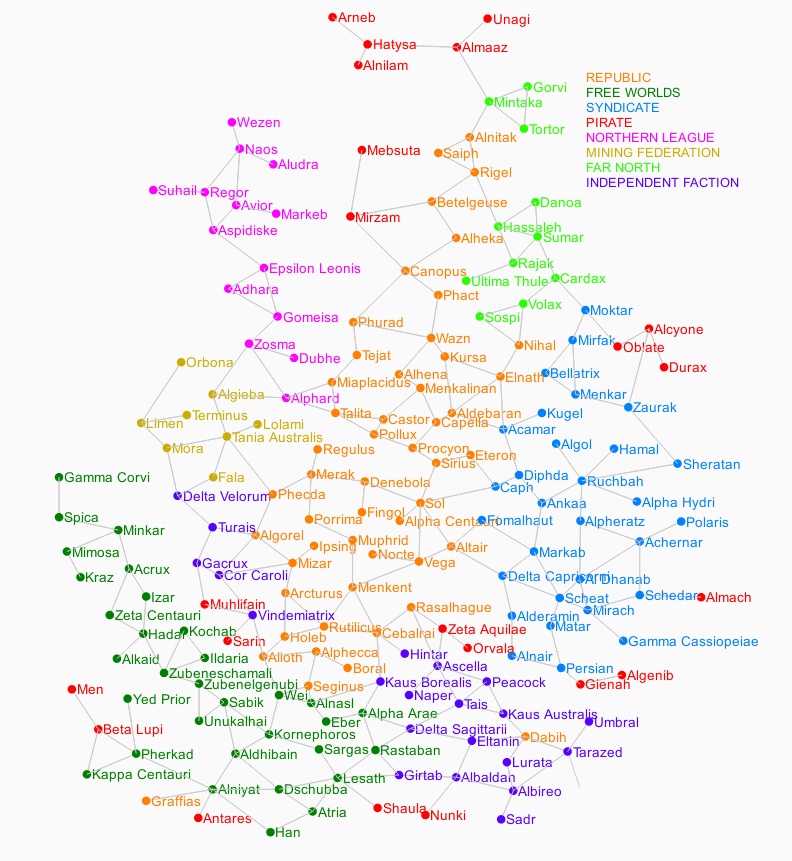

# Intro

80 years after the events of <a class="real" href="https://endless-sky.github.io/">Endless Sky</a>, space has suffered many changes. Worm holes have dissapeared. Humans have lost all contact with any alien race   

The **Republic** has been getting weaker day by day. Has lost two thirds of its systems due to wars or independence movements.  
The **Syndicate** finally became independent of The Republic. Now The Syndicate is a handful of megacorporations fighting each other.  
**Free Worlds** is the new emerging power. It has been expanding for decades.   
**Pirates** have been a growing problem.With a galaxy increasingly divided piracy is a very lucrative business.  
**Northern League** is the safest and most advanced region of space.They got independence at the same time as the Mining Federation.  
**Mining Federation** are the main suppliers of raw materials throughout the galaxy.  
The **Far North** is the new Wild West. Without law or government, law of the jungle reigns.  
**Independent Faction**

# Map

Human space map

